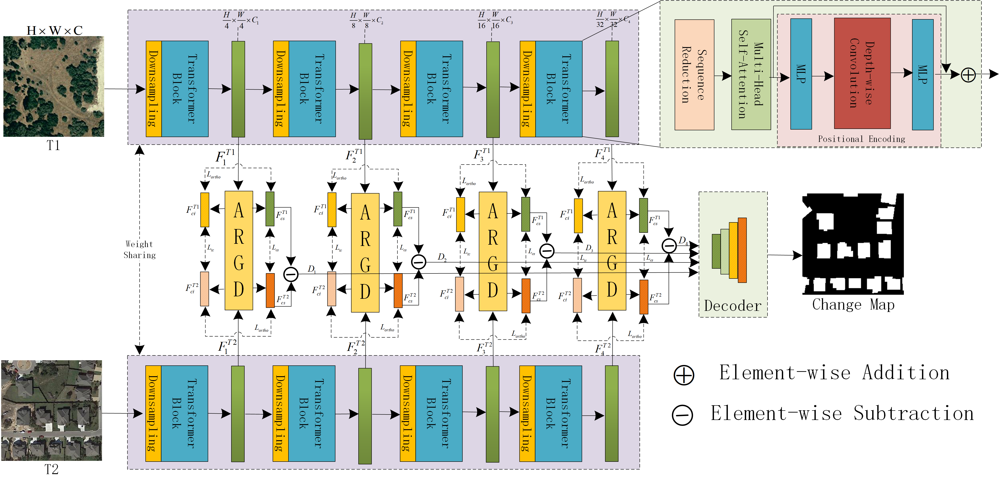

# Decouple then Align: A Disentangled Representation Learning Framework for Remote Sensing Change Detection

<div align="center">
  
</div>

<br/>

<div align="center">
    <a href="https://github.com/YangGuobao/DAnet/blob/main/LICENSE">
        
    </a>
    <a href="https://pytorch.org/">
        
    </a>
</div>

<br/>

## 📖 Introduction

This is the official implementation of **D&A-CDNet** (Decouple-then-Align Change Detection Network).

In Remote Sensing Change Detection (RSCD), existing deep learning methods often suffer from **pseudo-changes** caused by seasonal variations, lighting differences, and imaging conditions. We argue that the root cause is the high semantic entanglement between the object of interest and the background context in the deep feature space.

To address this, we propose a novel **"Decouple-then-Align"** paradigm:

1.  **Active Decoupling (Decouple)**: We design an **Adaptive Residual Gated Decoupling (ARGD)** module. It utilizes dual-attention background modeling and a non-linear gating mechanism to dynamically filter out noise and explicitly project features into **Change-Invariant** and **Change-Sensitive** subspaces.
2.  **Explicit Alignment (Align)**: We propose a **Multi-dimensional Orthogonal Alignment Strategy** to supervise the decoupling process explicitly:
    * **$L_{ortho}$ (Feature Orthogonality Constraint)**: Enforces geometric orthogonality between change-invariant and change-sensitive subspaces to prevent information mixing.
    * **$L_{tc}$ (Mask-guided Temporal Consistency Loss)**: Enforces strict alignment of background features in unchanged areas while relaxing constraints in changed areas.
    * **$L_{cs}$ (Contrastive Separation Loss)**: Pushes apart change-sensitive features in changed areas and pulls them closer in unchanged areas.

The proposed method achieves SOTA performance on **WHU-CD** ($F_1$ 96.04%) and **CDD** ($F_1$ 97.28%) datasets.

## 🚀 Main Results

**Quantitative Comparison on WHU-CD and CDD Datasets**

| Method | Backbone | Dataset | Precision | Recall | F1 Score | IoU |
| :--- | :---: | :---: | :---: | :---: | :---: | :---: |
| D&A-CDNet | PVT v2-B1 | **WHU-CD** | 96.54 | 95.55 | **96.04** | **92.39** |
| D&A-CDNet | PVT v2-B1 | **CDD** | 97.68 | 96.89 | **97.28** | **94.71** |

<br/>

**Feature Manifold Visualization (t-SNE)**

<div align="center">
  
  <br/>
  <div style="color: #808080; text-align: center; width: 80%;">
    <b>Figure 8. t-SNE visualization of feature manifolds on the CDD dataset.</b> <br/>
    (a) <b>Baseline</b>: Features of changed pixels (red) and unchanged pixels (blue) are severely entangled without explicit constraints. <br/>
    (b) <b>Ours</b>: Features form distinct, compact, and independent clusters with clear decision boundaries, demonstrating the effectiveness of the orthogonal alignment strategy in feature decoupling.
  </div>
</div>

<br/>

> **Note**: Our model achieves a good trade-off between performance and efficiency, with **46.21 M** parameters and **13.08 G** FLOPs (256x256 input).

## 🛠️ Requirements

The code has been tested with **Python 3.8+** and **PyTorch 2.0+**.

```bash
pip install -r requirements.txt
```

*Key dependencies:* `torch`, `torchvision`, `timm`, `safetensors`, `thop` (optional, for FLOPs calculation).

## 📂 Dataset Preparation

We follow the standard directory structure used in **WHU-CD** and **CDD**. Please organize your dataset as follows:

```text
data/
 ├── WHU-CD
    ├── train/          
        ├── A/          # T1 images (Pre-event)
        ├── B/          # T2 images (Post-event)
        ├── label/      # Ground Truth (0/255)
    ├── test/
        ├── A/ 
        ├── B/ 
        ├── label/            
    ├── val/
        ├── A/ 
        ├── B/ 
        ├── label/       
 ├── CDD
    ├── train/ ...
    ├── test/ ...
    ├── val/ ...
```

## ⚖️ Pretrained Weights

We use **PVT v2-B1** pre-trained on ImageNet as the backbone.

| Model | Source | Path |
| :--- | :--- | :--- |
| **PVT v2-B1** | [Official Release](https://github.com/whai362/PVT) | Place `pvt_v2_b1_weights.safetensors` in the project root directory. |

## ⚡ Usage

### 1. Training

To train the model using the hyperparameters described in the paper ($L_{tc}=0.5, L_{cs}=0.5, L_{ortho}=0.1$):

```bash
python train.py \
  --dataset_root ./data \
  --data_name CDD \
  --backbone pvt_v2_b1 \
  --pretrained True \
  --batchsize 8 \
  --trainsize 256 \
  --epoch 200 \
  --lr 0.0001 \
  --lambda_tc 0.5 \
  --lambda_cs 0.5 \
  --lambda_ortho 0.1 \
  --contrastive_margin 1.0
```

### 2. Evaluation

To evaluate the model on the test set:

```bash
python test.py \
  --dataset_root ./data \
  --data_name CDD \
  --backbone pvt_v2_b1 \
  --checkpoint_path ./checkpoints/CDD/DA_CDNet_Ortho_pvt_v2_b1_xxxx/best_model.pth
```

## 📝 Citation

If you use this code for your research, please cite our paper:

```bibtex
@article{DACDNet2026,
  title={Decouple then Align: A Disentangled Representation Learning Framework for Remote Sensing Change Detection},
  author={Yang, Guobao and et al.},
  journal={},
  year={2026},
  note={Under Review}
}
```

## 🙏 Acknowledgements

We appreciate the open-source community. Part of this code is inspired by [BIT](https://github.com/justchenhao/BIT_CD) and [ChangeFormer](https://github.com/wgcban/ChangeFormer).

## 📄 License

This project is licensed under the [Apache 2.0 License](LICENSE).
